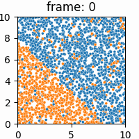

# Avaliação de algoritmos de classificação em dados de fluxo contínuo com mudança de conceito
---
## Ewerton Luiz Costadelle
## Regis Antonio Saraiva Albuquerque
## Silvana de Andrade Gonçalves
---

Esperamos utilizar a biblioteca [River ML](https://riverml.xyz/0.16.0/introduction/getting-started/concept-drift-detection/#impact-of-drift-on-learning)

Conceitos a ser abordado
- DataStream Learning (DSL)
- Concept Drift

DATASETS (4 artificiais e 2 reais)
- [SEA](./artificial/sea), 50k instancias, 3 atributos (2 relevantes), classificação binária, deslocamento abrupto
- +3 Datasets Artificiais (Abrupto e Gradual) **to do**
- Weather (real / original source)
- Poker Hand (real / original source)

Análise das Bases
- análise exploratória, através de visualização, demonstrando onde tem Drift (Onde tem)
- experimentar algoritmos detectores de Drift (Bonus)

|  | 
|:--:| 
| **Fig 1:** *Concept drift in sea database* |

Avaliar métricas em classificadores disponíveis: 
- ExtremelyFastDecisionTreeClassifier
- ARFClassifier
- LeveragingBaggingClassifier
- KNNClassifier

Expectativa de realizar 24 Testes (6 bases X 4 algoritmos)

